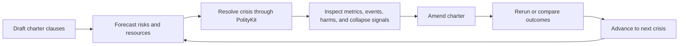

# Charterfall

## One-Page Pitch

**Genre:** roguelike settlement governance prototype.

**Player role:** founder, steward, and charter drafter for a fragile fictional settlement.

Charterfall is the first playable vertical slice for the Constitutional Survival City Builder. Each run asks the player to draft a civic charter for an intermittently isolated settlement, survive three linked crises, inspect what happened, amend the rules, compare the outcome, and continue. The prototype uses an abstract settlement rather than full spatial construction so it can focus on the central question: is it fun to make institutions playable, watch them protect or fail people under stress, and revise them from evidence?

## Session Structure

1. **Draft a charter**
   Choose three to five institutional clauses that shape allocation, authority, transparency, accountability, and emergency power.

2. **Forecast pressure**
   Review the settlement profile, known risks, scarce resources, citizen needs, and faction concerns before committing to the crisis.

3. **Survive the crisis**
   Resolve a PolityKit scenario such as food shortage, medicine shortage, or corruption pressure under the selected charter assumptions.

4. **Review an inquiry**
   Inspect metrics, event timelines, bottlenecks, harmed groups, citizen story cards, collapse signals, and surprising effects.

5. **Amend and compare**
   Change clauses or parameters, rerun from the same starting conditions, and compare the amended outcome against the prior run.

6. **Continue**
   Carry a compact inquiry summary, prior run IDs, and the selected charter into the next crisis.

## Core Loop Diagram

## Intended Feel

Charterfall should feel compact, legible, replayable, and consequence-focused. The player should understand what they chose, what happened, who was helped or harmed, and why a revision might matter. Failure should invite inquiry rather than punishment.

## Minimum First-Run Content

- One fictional settlement profile.
- Intermittent-isolation premise that explains why local rules matter.
- Three linked crisis scenarios.
- Three to five charter dimensions.
- Five displayed inquiry metrics.
- Event timeline with filtering.
- Citizen story cards grounded in run outputs.
- Same-seed rerun.
- Before/after comparison.
- Win state.
- Fail state.

## Simulation Surfaces

The first prototype can call PolityKit through these surfaces:

- `GET /api/models` to list available governance models.
- `GET /api/metrics` to identify player-facing inquiry metrics.
- `GET /api/scenarios` to select or validate crisis inputs.
- `POST /api/runs` to resolve a crisis under the selected settlement, charter, seed, and scenario.
- `GET /api/runs/{id}/dashboard` to populate the inquiry screen with metrics, events, summaries, and timelines.
- `POST /api/runs/{id}/rerun` to test amended clauses from the same starting conditions.
- `GET /api/runs/{id}/compare/{comparisonId}` to show before/after consequences.

Stress and sensitivity views can use `POST /api/runs/sweep` and `POST /api/runs/stress` later, but they are not required for the first run.

## Boundary

Charterfall shows how fictional institutional rules behave inside declared simulation assumptions. It does not prove that a real-world political, economic, or social system is superior.

Use fictional settlements, fictional factions, inspectable assumptions, and comparison language such as "under these assumptions." Citizen stories, inquiries, and comparisons should dramatize deterministic run outputs without inventing authoritative simulation facts.
