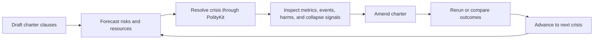

# Charterfall Milestone 0: Product Framing

Milestone 0 turns the Charterfall concept into a buildable design target. It should leave the project with enough shared language, artifact shape, and simulation mapping for a contributor to start the prototype without re-litigating the premise.

This milestone is documentation and product-design work, not a playable implementation. Its output should be precise enough to drive Milestone 1.

## Goal

Define Charterfall as a small, playable institutional survival game built on top of PolityKit's deterministic simulation layer.

By the end of this milestone:

- A contributor can explain the game loop in one minute.
- Every player-facing rule has either a PolityKit mapping or an explicit game-layer-only purpose.
- Political and social claims are bounded as assumption-based simulation results, not real-world proof.
- The first prototype has a clear content target: one settlement, three crises, a small charter surface, visible metrics, and compare/rerun flow.

## Deliverables

### 1. Game Design Brief

Create a concise design brief for the long-term Constitutional Survival City Builder.

The brief should include:

- One-paragraph product description.
- Core fantasy: the player as a constitutional architect for a fragile settlement.
- Core loop: build institutions, face crises, inspect consequences, revise the system, try again.
- Five pillars: visible settlement, playable institutions, crisis-driven simulation, inspectable consequences, and revision over optimization.
- Scope distinction between the long-term city builder and Charterfall.
- Non-goals for the first slice, including full spatial construction, full save/load, deep population simulation, and procedural narrative campaigns.

Definition of done:

- The brief can be read in under five minutes.
- It distinguishes PolityKit responsibilities from game-layer responsibilities.
- It does not promise features that Milestone 1 is not expected to build.

### 2. Charterfall One-Page Pitch

Create a one-page pitch for Charterfall as the first vertical slice.

The pitch should include:

- Title: `Charterfall`.
- Genre: roguelike settlement governance prototype.
- Player role: founder, steward, or charter drafter.
- Session structure: draft a charter, survive three linked crises, review an inquiry, amend, compare, and continue.
- Why the slice exists: prove whether playable institutional drafting is fun before adding a full city builder.
- Intended feel: compact, legible, replayable, and consequence-focused.
- Minimum first-run content: one settlement profile, three crisis scenarios, three to five charter dimensions, five displayed metrics, event timeline, rerun, comparison, win state, and fail state.

Definition of done:

- A new contributor can summarize the game loop from the pitch alone.
- The pitch avoids marketing language that hides the actual mechanics.
- The pitch names the simulation surfaces the prototype will call.

### 3. Core Loop Diagram

Add a simple loop diagram that can be rendered in Markdown.

Recommended Mermaid source:



The diagram should be included wherever the product framing lives so it remains close to the pitch and design brief.

Definition of done:

- The loop uses verbs that match actual player actions.
- `Crisis` is explicitly tied to PolityKit.
- `Inquiry` and `Compare` are visible as first-class gameplay beats, not afterthoughts.

### 4. Playable Institutional Clauses

Define the initial clause surface for Charterfall. These are the rules the player can understand, choose, and later amend.

Initial dimensions:

| Dimension | First playable options | Player-facing question |
|---|---|---|
| Allocation method | Need-based, market-based, hierarchy-based, participatory, hybrid | Who gets scarce resources first? |
| Decision authority | Council, expert office, local districts, emergency executive | Who can make binding crisis decisions? |
| Transparency | Public ledger, delayed reporting, closed administration | How visible are decisions and shortages? |
| Accountability | Appeal board, audit office, citizen review, none | Who can challenge or review decisions? |
| Emergency powers | None, limited, renewable, broad | What can be bypassed during acute danger? |

Each clause definition should include:

- Stable ID.
- Display name.
- Short player-facing description.
- Tradeoff text.
- PolityKit mapping.
- Game-layer-only effects, if any.
- Unlock or campaign availability, if any.
- Wording boundary that keeps the clause fictional and assumption-based.

Recommended first-pass JSON shape:

```json
{
  "id": "allocation.need_based",
  "dimension": "allocation_method",
  "displayName": "Need-Based Allocation",
  "description": "Prioritize citizens with the highest unmet need.",
  "tradeoff": "Can protect vulnerable citizens, but may increase administrative load.",
  "polityKit": {
    "model": "need-based-allocation",
    "parameters": {
      "needWeightMultiplier": 1.0
    }
  },
  "gameLayerEffects": [],
  "boundary": "Represents a simplified crisis rule, not a claim about any real institution."
}
```

Definition of done:

- At least three dimensions are prototype-ready.
- Every option has a stable ID before UI work begins.
- Every option has either a concrete model/parameter/scenario mapping or is marked game-layer-only.
- The wording makes tradeoffs legible without declaring universal superiority.

### 5. Clause-To-PolityKit Mapping

Create a mapping table from Charterfall clauses to existing PolityKit surfaces.

Current usable surfaces:

| Game concept | PolityKit surface | Notes |
|---|---|---|
| Need-based allocation | `need-based-allocation` model | Existing baseline model. |
| Market-based allocation | `market-based-allocation` model | Existing baseline model. |
| Hierarchy-based allocation | `hierarchy-based-allocation` model | Existing baseline model. |
| Composite governance bundle | `CompositeGovernance:<preset-id>` | Use current preset manifests as source of truth. |
| Participatory commons | `CompositeGovernance:participatory-commons` | Candidate first charter preset or comparison model. |
| Regulated market | `CompositeGovernance:regulated-market` | Candidate first charter preset or comparison model. |
| Technocratic administration | `CompositeGovernance:technocratic-administration` | Candidate first charter preset or comparison model. |
| Food crisis | Scenario file or built-in scenario | Start from `village-food-crisis` or an authored Charterfall scenario. |
| Medicine crisis | Scenario file | Start from `examples/medicine-shortage.json` if present and suitable. |
| Corruption pressure | Scenario file | Start from `examples/corruption-stress.json` if present and suitable. |
| Same-seed amendment | `POST /api/runs/{id}/rerun` | Use when the player changes clauses after inquiry. |
| Before/after view | `GET /api/runs/{id}/compare/{comparisonId}` | Use after rerun or branch comparison. |
| Public inquiry dashboard | `GET /api/runs/{id}/dashboard` | Source for summary metrics and event timeline. |
| Robustness preview | `POST /api/runs/stress` | Milestone 3+ by default; can be exposed as advanced prototype mode. |

Mapping rules:

- Prefer existing model IDs and governance preset IDs for Milestone 1.
- Do not invent UI clauses that imply simulation effects before the mapping exists.
- If a clause is presentation-only, mark it explicitly and keep it out of run configuration.
- If a clause maps to a parameter, record the exact parameter name, default value, allowed range, and why the range is game-safe.
- If multiple clauses affect the same PolityKit parameter, define precedence before implementation.

Definition of done:

- The mapping table covers every initial clause.
- Unmapped clauses are deliberately deferred or labeled game-layer-only.
- A prototype developer can construct a `POST /api/runs` request from the selected charter.

### 6. First Prototype Run Contract

Define the request and response path the prototype should use.

Draft run creation:

```http
POST /api/runs
```

Example body:

```json
{
  "scenario": "village-food-crisis",
  "models": [
    "need-based-allocation"
  ],
  "seed": 20260616,
  "ticks": 60,
  "parameters": {
    "needWeightMultiplier": 1.0
  }
}
```

Inquiry:

```http
GET /api/runs/{id}/dashboard
```

Amended rerun:

```http
POST /api/runs/{id}/rerun
```

Comparison:

```http
GET /api/runs/{id}/compare/{comparisonId}
```

Definition of done:

- The milestone document states which fields come from the selected settlement, crisis, charter clauses, and campaign state.
- The first prototype can hard-code one scenario and one model while keeping the contract compatible with later clause composition.
- The UI never requires raw JSON interpretation to understand a run.

### 7. Player-Facing Metrics

Choose five default metrics for Charterfall's first public inquiry screen.

Recommended first set:

| Metric role | Player-facing label | Purpose |
|---|---|---|
| Survival | Needs met | Shows whether the settlement materially endured the crisis. |
| Harm | Severe failures | Shows who was failed badly enough to matter narratively. |
| Legitimacy | Trust | Shows whether people still accept the system. |
| Equity | Inequality | Shows distributional tradeoffs. |
| Friction | Administrative load | Shows the cost of process, transparency, and review. |

Metric guidance:

- Use player-facing labels in the UI.
- Keep raw PolityKit metric names available in tooltips, debug panels, or developer documentation.
- Present deltas in comparison views, not just final absolute values.
- Avoid a single universal score in Milestone 1. Win/fail states can use thresholds, but inquiry should remain multi-metric.

Definition of done:

- The five metrics are named and mapped to available API/dashboard data.
- Each metric has one sentence explaining why a player should care.
- Comparison language says "changed under this run" rather than "proved better."

### 8. Settlement And Crisis Content

Define the first content pack.

Settlement profile:

- Name: `Greywater Compact` or another fictional settlement name.
- Population: small enough for a compact prototype, large enough for scarcity to feel social rather than individual.
- Starting concerns: food security, medicine access, housing fragility, trust, and administrative capacity.
- No real-world place, ideology, ethnicity, religion, or party should be implied.

Three prototype crises:

| Crisis | Simulation source | Design purpose |
|---|---|---|
| Failed Harvest | Food shortage scenario | Tests allocation pressure and visible unmet need. |
| Fever Season | Medicine shortage scenario | Tests vulnerability, triage, and trust. |
| Supply Office Scandal | Corruption stress scenario | Tests transparency, accountability, and legitimacy. |

Definition of done:

- Each crisis has a scenario source or scenario authoring task.
- Each crisis states which charter dimensions it is meant to stress.
- The three-crisis campaign has an order, shared seed policy, and carryover policy.

### 9. Win, Fail, And Carryover Rules

Define simple rules before building the prototype.

Recommended fail states:

- Collapse detected by configured failure criteria.
- Severe unmet need crosses a threshold.
- Trust falls below a minimum threshold.

Recommended win state:

- The settlement survives all three crises while keeping needs met, trust, and severe failures above or below documented thresholds.

Recommended carryover for Milestone 1:

- Carry forward campaign chapter number, prior run IDs, selected charter, and inquiry summaries.
- Do not carry detailed world state between crises until the simulation/game translation layer is designed.
- Treat each crisis as a deterministic scenario run with campaign context attached by the game layer.

Definition of done:

- Threshold names are documented even if exact values are tuned later.
- The prototype can explain why the player won, failed, or advanced with warnings.
- Carryover is intentionally limited so Milestone 1 remains achievable.

### 10. Political Framing And Claims Boundary

Add a Charterfall-specific framing note.

Required wording:

```text
Charterfall shows how fictional institutional rules behave inside declared simulation assumptions. It does not prove that a real-world political, economic, or social system is superior.
```

Use this boundary in:

- Game design brief.
- Pitch.
- Clause definitions.
- Public inquiry copy.
- Comparison screens.
- Scenario authoring notes.

Framing rules:

- Use fictional settlement names and fictional factions.
- Treat preset labels as experiment handles, not descriptions of real societies.
- Make assumptions inspectable before showing conclusions.
- Keep AI-generated text, if used later, advisory and separate from deterministic simulation output.
- Prefer "under these assumptions" language for all comparisons.
- Avoid ranking ideologies, communities, nations, or real institutions.

Definition of done:

- The claims boundary appears in Milestone 0 artifacts.
- The UI copy plan avoids real-world proof language.
- Contributors know where simulation data ends and interpretation begins.

## Milestone 0 Artifact Checklist

Create or update these artifacts during Milestone 0:

| Artifact | Suggested path | Required before Milestone 1? |
|---|---|---:|
| Game design brief | `docs/charterfall/design/constitutional-survival-city-builder.md` | Yes |
| Charterfall pitch | `docs/charterfall/design/charterfall-pitch.md` | Yes |
| Core loop diagram | In pitch or design brief | Yes |
| Clause catalog | `docs/charterfall/design/clauses.md` or JSON later | Yes |
| Clause mapping table | In clause catalog | Yes |
| First content pack | `docs/charterfall/design/first-content-pack.md` | Yes |
| Framing and claims boundary | `docs/charterfall/design/framing-boundaries.md` | Yes |
| Prototype API contract | `docs/charterfall/implementation/prototype-contract.md` | Helpful before code |

These paths are recommendations. If the repository chooses a different documentation structure, keep the artifact names and cross-links stable.

## Implementation Notes For Milestone 1

Milestone 0 should set up these Milestone 1 decisions:

- First UI can be a lightweight web app that calls the existing PolityKit API.
- First charter implementation can start with one selected model per run, then grow toward composed presets or parameterized clause bundles.
- First campaign can attach context in the game layer instead of changing PolityKit's scenario model.
- First inquiry screen should use dashboard data and event timelines already exposed by the API.
- First comparison screen should use stored run comparison rather than recomputing deltas in the UI.
- Stress and sensitivity views should remain out of the critical path unless the prototype is already stable.

## Acceptance Verification

Milestone 0 is complete when the following checks pass:

1. A contributor can explain Charterfall as: draft rules, face a crisis, inspect consequences, amend, compare, and continue.
2. The initial clause catalog has stable IDs, player-facing text, tradeoffs, and PolityKit mappings.
3. The mapping table accounts for every player-facing rule in the first prototype.
4. The first content pack names one settlement profile and three crisis scenarios.
5. Win, fail, and carryover rules are documented at prototype fidelity.
6. The claims boundary is included and uses assumption-bound language.
7. Milestone 1 has enough detail to begin UI/API integration without inventing the product framing from scratch.

## Open Decisions

These should be closed before or during early Milestone 1:

- Should Charterfall's first prototype use only baseline models, only governance presets, or a small mix?
- Should selected clauses map directly to a single model ID, or should a translation layer compose a `CompositeGovernance` profile later?
- Which exact PolityKit metric names power the five player-facing inquiry metrics?
- Should the three-crisis campaign use one shared seed, fixed scenario seeds, or user-visible seed selection?
- Should Charterfall docs live entirely under `docs/charterfall/design`, or should some become machine-readable content under a future app project?
